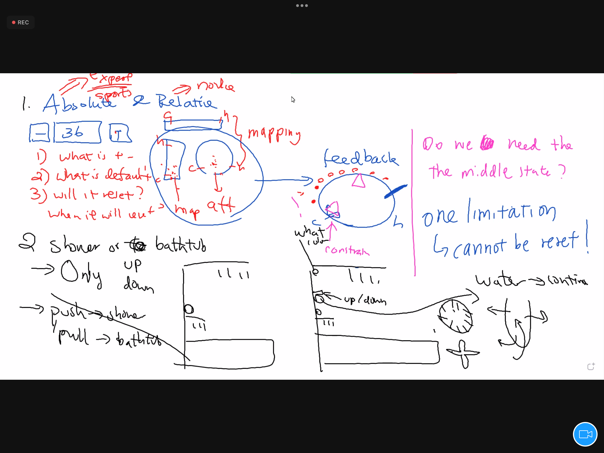

# Classwork

- Attempt to redesign the elevator buttons so to minimize people
accidentally closing the door.
- Submit a screenshot and roughly 300 words arguing why you think
your design will solve the problem to Google Classroom.

1. Absolute & Relative
2. Shower or bathtun
- only up or down
- push -> shown
- pull -> bathtub