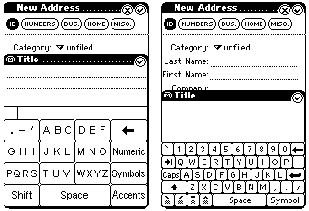

# Task 01

## Given two baseline input methods: QWERTY and T9, and our proposed method:
Swiping Gestures which we claim to be faster and more accurate. Design an
experiment discussing:
- Research question 
    - How does swipe compared to QWERTY and T9 in different context, such as in different screen sizes where swipe may not have clear advantage ?
- Hypotheses:
    1. Swipe outperform QWERTY and T9 in terms of speed in small
    2. In big screen size, there is no significant difference between Swipe and the other methods
    3. For learning, users should be able to learn Swipe and start to show a better performance than QWERTY and T9 after some bloacks of trails
    4. Swipe may have lower accuracy, since it varies based on the capabilities of the word prediction
- Independent variables
    -  3levels (QWERTY, T9 ,SWIPE);
    - Let's say we have one more IV that is Screen size with 2 lebel (Small and Large)
    - This becomes a 3x2 factorial desgin with 6 conditions 
- Dependent variables
    - Speed, Accuracy, and learning over blocks
- Any possible confounding/random/control variables
    - Control variables - place, phone, key, font, etc.
    - Random variables - past experineece
    - Confounding variables - implementation, task, order
- Within or Between subject design
    - leaerning can be mitigated
- Task
    - representative numbevr of occurrences of character (perchaps use some proven dataset like http://www.yorku.ac/mack/PhraseSets.zip)
- Order
    - We counterbalance using balanced latin square thus we need at least a multiple of 6 participants. 12 or 18 are good number.
- Total experimental time
    - 3 inputs methods x 2 screen size x 3 blocks x 6 ranodm phrases x 28s = 3024s = 50 min + 5 breaks x 1min = 55 mins