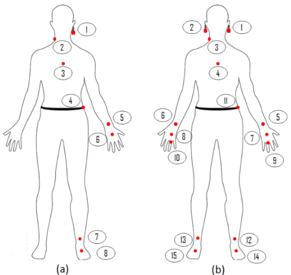

# Task 02

## Source: Dim and Xiangshi 2017,
https://www.sciencedirect.com/science/article/abs/pii/S107158191630088X
- Research Question: Which body parts are suitable for wearable vibration feedback in walking navigation for blind people?

- Independent variables: body parts (ears, neck, wrist, hand, chest, waist, ankle, front foot, mirrored on both sides), postures (standing, normal walking, fast walking), stimulus durations (700ms, 1000ms, 1500ms, 2000ms)

- Dependent variables: Perceivability and subjective preferences

- Design the rest of the experiment, including the task and procedure, the place of experiment, the participants, the order effects, number of trials and blocks, and last, calculate the total time of the experiment
    - task : 
    - procedure :
        - testing with 2 both sides of device with 
        - 
    - place : flatten place such as park and athelte stadium
    - partcipants : 32 participants
    - order effect : 
    - number of trials and block, and last
    - calculate the total time of the experiment
    8 devices * 2 posture * 2 = 32 conditions * 20 = 640
    break 1.5 minutes
    640x + 120x = 3600
    4 trails = 48.something minutes

## Work Solution
- Hypothesis could be something like Upper body parts overall performed best, Longer stimulus durations may be needed for lower body parts, Walking will generally require longer stimulus durations
- Possible design: 16 body positions x 3 postures x 4 durations x 3 trials = 576 trials
- Since each trial takes around 1s (actually 1.3s) with 2.5s in between, the total time is 3.5s x 576 - 2.5s = 2013.5s / 60 = 33.558 mins - this is fair amount of time when counting time for filling questionnaires
- The order of body positions and stimulus duration were randomized but each body position will receive exactly 3 trials for each stimulus duration. After one posture is done, we swap to another posture. The order of posture is done using Latin-square
- The speed of walking must be controlled across participants (1.25m/s). The fast walking was using 4.5m/s
- Participants could be blind people or teenagers depending on the target audience. 15 should be nice numbers since it's the 3s multiple of the Latin-square
- Place of environment - could be another IV but would require another study
- After each posture, participants rated their perception of the vibration for each body position, with 1 - most difficult to perceive and 7 as easiest to perceive
- Devices could be any arduino vibrators like Lilypads

