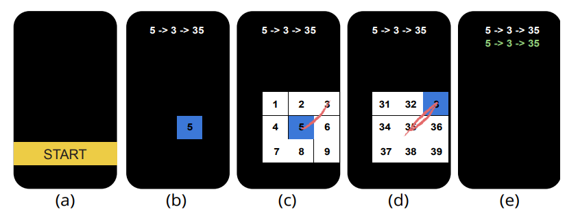

# Task 03

## Figure: Source: Zheng et al. CHI 2018;
https://www.youtube.com/watch?v=SBVRT_x0xYY
- Research Question: We have proposed a gesture menu used in mobile phones - How does the newly proposed gesture menu compared to linear menu (baseline)?

- Independent variables: Input method (linear menu vs. gesture menu), Depth (1, 2, 3), Execution (guided, recall) (i.e., with instructions or no instruction)

- Dependent variables: Time and error rates

- Design the rest of the experiment, including the task and procedure, the participants, the order effects, number of trials and blocks, and last, calculate the total time of the experiment 

## Solution
- Depth is one of the challenge. 
    - In D1, there are 8 possible gestures, 
    - D2 - 64 gestures, D3 - 512 gestures. To test all depths, it is possible to test completely D1 and 2 gestures, not but D3. And due to time, we definitely cannot test more than D4 and so on. 
    - For D3, we may test another 64 gestures randomizing from the sample of 512 gestures, depending on the experimental time. Since depth is an increasing complexity, the order will be strictly D1 - 2 - 3
- Another issue is the recall and guided. Obviously we should test guided before recall since there is nothing to recall. Input method can be easily fully counterbalanced
- For the number of trials, this needs to be prior tested before knowing how many repetitions before participants start to be good at using our menu. We found 4 trials are adequate
- This could be a design with 2 input methods x 136 gestures (8+64+64) x 2 execution x 4 trials = 2176 trials
- Since each trial takes around 1s with 1s in between, the total time is 2s x 2176 trials - 1s = 4350s / 60 = 72.5 mins 
    - this amount of time could be too much for participants. Thus you may want to do only 32 gestures for depth 3. 
    - Try recalculate. How much total time?