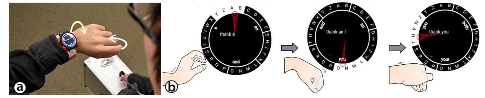

# TASK 04 

## Figure: Source: Gong et al. CHI 2018;
https://dl.acm.org/doi/10.1145/3173574.3173755, downloads:
https://cs.dartmouth.edu/~zheer/files/WrisText.pdf

Summarize the paper into a table with the following information: 
(1) Research Questions, 
(2) Hypothesis (usually hidden) Also, for each of the two studies, summarize into a table with the following information:
(1) Independent variables and Dependent variables, 
(2) Number of participants, 
(3) Apparatus if any, 
(4) Task and procedure, 
(5) Data analysis technique (only name is ok),
(6) Key findings,
(7) Your own personal discussion what is good, what can be better

- Research Question: How to best design wrist-based one-handed small-form-factor 
text entry entry technique? Also, can users learn
the technique?
- **Hypothesis**: 
    - (1) Human performance on the wrist will determine how many directions 
    they can perform with reasonable accuracy which will then can be further 
    optimized in the keyboard layout (study 1), 
    - (2) Users can master how they use the wrist after several days of training,
    and eventually can even perform eyes-free input (study 2)

- Study 1
    - IV: Target Location (8), Target Size (5)
    - DV: Time, Accuracy, Comfort
    - Participants: 15
    - Apparatus: Smartwatch, laptop
    - Task: 8 location x 5 size x 5 repetitions x 15 participants
    - Data analysis: ANOVA with posthoc bonferroni corrections; questionnaires for comfort ratings
    - Findings : A target size need to be at least 55.2 degree

- Study 2:
    - IV: Postures (hand up and down)
    - DV: Speed, Accuracy, Auto-completion rate (over 5 days)
    - Participants: 10
    - Apparatus: Smartwath without a ticwatch phototype; Finger-worn capacitive sensors; 
    27 inch screen to illustrate what input text
    - Task: 10 participants x 5 repetition x 18 trials x 2 postures
    - Data analysis: ANOVA with posthoc bonferroni corrections
    - Findings: User can improve through practice over time and can even 
    perform eyes-free input with even better performance!