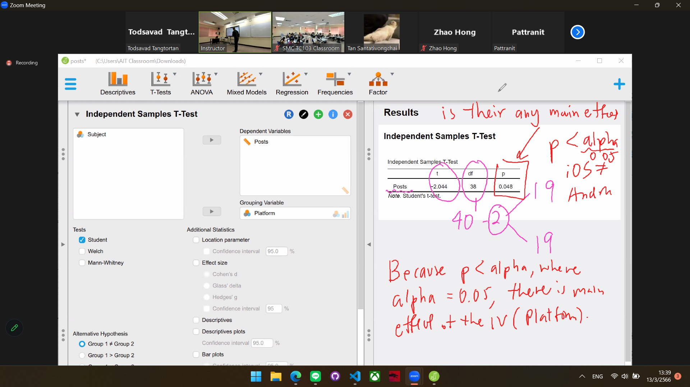
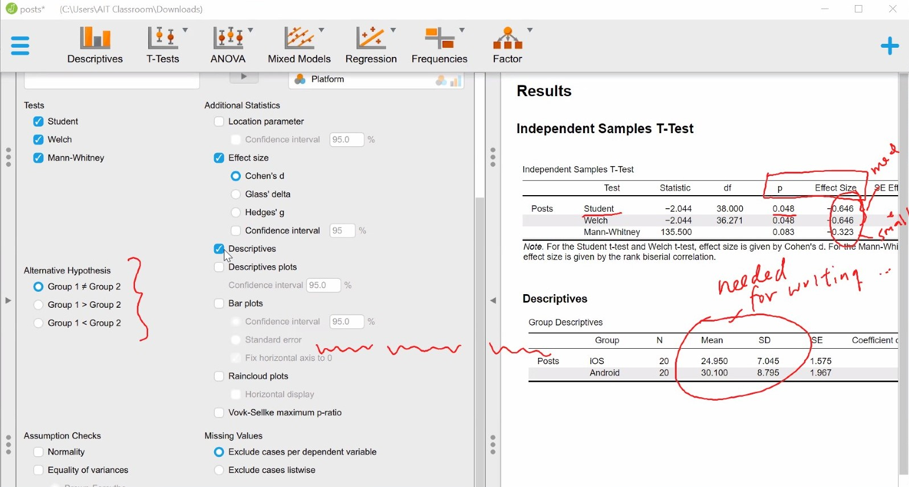
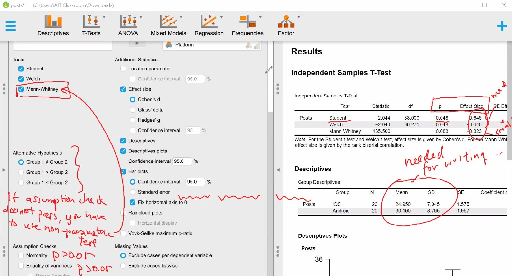
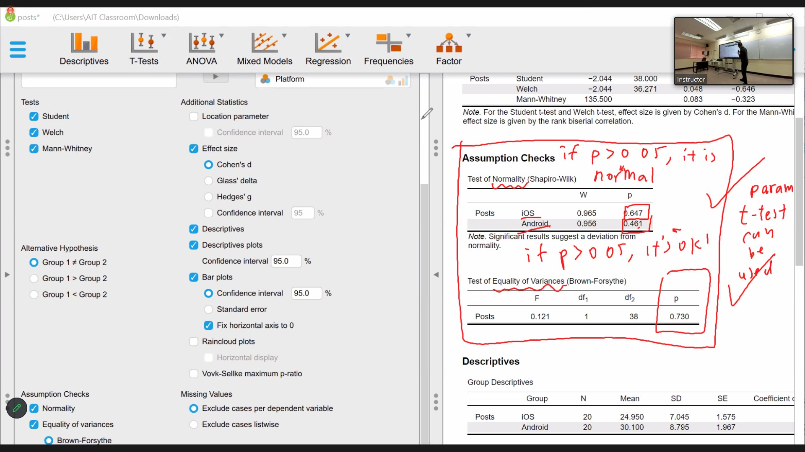

# Task 1: T-Test
File used: posts.sav

1. How many participants ? Ans 40
2. W/b Ans between-subject
3.  How many IV ? Ans 1-platform
    How many level Ans 2
4. What is/are the DV Ans # of fb posts

We found the a main effect of platform (t38 = -2.044, p< 0.05>)
berween iOS (mean= ? sd=?) and andriod  (mean= ? sd=?)

cohen-d small 0.2 medium 0.5 large 0.8

Answer the followings:
1. Is this a between-subjects or within-subjects experiment? Why?
- between-subjects
2. What is the independent variable named?
- 1-platform
3. How many levels does the independent variable have? What are they?
- 2 level iOS and Andriod
4. How many subjects were in this experiment?
- 40
5. How many subjects were exposed to each level of the independent variable? Is the design balanced (i.e., are the numbers equal)?
- 20
6. What are the mean and standard deviation number of posts for each level of the independent variable?
- iOS     m = 24.95  SD = 7.045
- Android m = 30.100 SD = 8.795
7. Assuming equal variances, what is the t statistic for this t-test? (Hint: this is also called the t Ratio.)
- Student -2.044 (Statistic)
- Wetch -2.044
8. How many degrees of freedom are there (dfs)?
- Student 38
- Wetch 36.271
9. What is the two-tailed p-value resulting from this t-test? Is it significant at the α = .05 level?  
- Yes p < 0.05 (Effect Size : Independent Samples T-Test)
10. The formulation for expressing a significant t-test result is: t(dfs) = test statistic, p < p-value thresholds,  d = cohen d.  For an insignificant result, it is: t(dfs) = t-statistic, n.s. Write your result just like you would do in a research paper.   Read https://www.socscistatistics.com/tutorials/ttest/default.aspx for more detail how to report.
-  We found that a significant effect of platform (t(dfs) = t(38) = -2.044, p < 0.05, d = -0.646) on the number of facebook posts between iOS (Md = 24.95  SD = 7.045) and Android (Md = 30.100 SD = 8.795)
11. The equivalent of a between-subjects (independent samples) t-test using nonparametric statistics is the Mann-Whitney U test. The Mann-Whitney U test is a test for an experiment containing one between-subjects factor with two-levels. The formulation for expressing a Mann-Whitney U-test is U = test statistic, p < p-value thresholds, r = rank biserial correlation. Note that when you use a non-parametric test, *report the median instead of the mean.*  Write your result just like you would do in a research paper. 
-  We fail that a significant effect of platform (U = 135.5, n.s) on the number of facebook posts between iOS(m = 24.95) and Android (m = 30.100)
- p < alpha -> p < 0.05 wrong because p = 0.083
*Student & Welch, effect size = Cohen's d*
*Mann-Whitney,    effect size = the rank viserial correlation*

# Task 2: One-way ANOVA with two levels
File used: posts.sav

Repeated measures ANOVA is within subject
ANOVA - between subject

0.01 : Small effect size
0.06 : Medium effect size
0.14 or higher: Large effect size

Answer the followings:
1. What is the output of the Q-Q plot test? Is the data normal?  How about homogeneity of variance tests?
- points align with the Q-Q plot, so it looks normal. A Shapiro-Wilk test confirms the normality (p>0.05) For homogeneity of varauiances, aLevene test confirms the assumption check (p>0.05)
2. Do the number of observations (N’s) and means agree with those produced by the t-test? What are they? (If they do not agree, there is an error somewhere!)
- Yes
3. In the ANOVA table, what is the F-statistic? What is the p-value? Is it significant at the α = .05 level?
- F-statistic = 4.177, p-value = 0.048, it is significant
4. How does this p-value compare to that produced by the t-test? 
- Yes it equal p < .05
5. What is the effect size in terms of partial eta squared?  What is the interpretation?
- 0.099 Medium
6. The general formulation for expressing an F-test result is: F(df-between,df-within) = F-ratio, p < .05 (or n.s.),  η2p = partial eta squared value. Report just like you would in a research paper. Read this for more detail - https://shengdongzhao.com/newSite/how-to-report-statistics-in-apa-format/
- We found that a significant effect of platform (F(df-between,df-within)=F(1) = 4.177, p < .05,  η2p = 0.099) on the number of facebook posts between iOS (Md = 24.95  SD = 7.045) and Android (Md = 30.100 SD = 8.795)
7. In case your data cannot use ANOVA, you can use Kruskal-Wallis test, where the formulation is H(df) = statistics, p < threshold.  Report just like you would in a research paper. 
- We fail that a significant effect of platform (H(1) = 3.053, n.s) on the number of facebook posts between iOS(m = 24.95) and Android (m = 30.100)