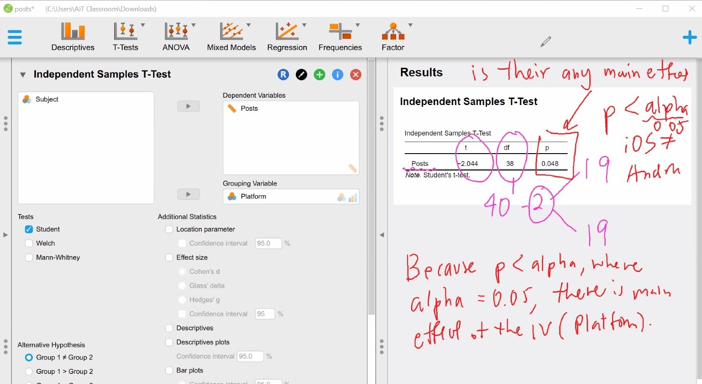

# Task 1: T-Test
File used: posts.sav

1. How many participants ? Ans 40
2. W/b Ans between-subject
3.  How many IV ? Ans 1-platform
    How many level Ans 2
4. What is/are the DV Ans # of fb posts

We found the a main effect of platform (t38 = -2.044, p< 0.05>)
berween iOS (mean= ? sd=?) and andriod  (mean= ? sd=?)

cohen-d small 0.2 medium 0.5 large 0.8

Answer the followings:
1. Is this a between-subjects or within-subjects experiment? Why?
- between-subjects
2. What is the independent variable named?
- 1-platform
3. How many levels does the independent variable have? What are they?
- 2 level iOS and Andriod
4. How many subjects were in this experiment?
- 40
5. How many subjects were exposed to each level of the independent variable? Is the design balanced (i.e., are the numbers equal)?
- 20
6. What are the mean and standard deviation number of posts for each level of the independent variable?
- iOS     m = 24.95  SD = 7.045
- Android m = 30.100 SD = 8.795
7. Assuming equal variances, what is the t statistic for this t-test? (Hint: this is also called the t Ratio.)
- Student -2.044 (Statistic)
- Wetch -2.044
8. How many degrees of freedom are there (dfs)?
- Student 38
- Wetch 36.271
9. What is the two-tailed p-value resulting from this t-test? Is it significant at the α = .05 level?  
- Yes p < 0.05 (Effect Size : Independent Samples T-Test)
10. The formulation for expressing a significant t-test result is: t(dfs) = test statistic, p < p-value thresholds,  d = cohen d.  For an insignificant result, it is: t(dfs) = t-statistic, n.s. Write your result just like you would do in a research paper.   Read https://www.socscistatistics.com/tutorials/ttest/default.aspx for more detail how to report.
-  We found that a significant effect of platform (t(dfs) = t(38) = -2.044, p < 0.05, d = -0.646) on the number of facebook posts between iOS (Md = 24.95  SD = 7.045) and Android (Md = 30.100 SD = 8.795)
11. The equivalent of a between-subjects (independent samples) t-test using nonparametric statistics is the Mann-Whitney U test. The Mann-Whitney U test is a test for an experiment containing one between-subjects factor with two-levels. The formulation for expressing a Mann-Whitney U-test is U = test statistic, p < p-value thresholds, r = rank biserial correlation. Note that when you use a non-parametric test, *report the median instead of the mean.*  Write your result just like you would do in a research paper. 
-  We fail that a significant effect of platform (U = 135.5, n.s) on the number of facebook posts between iOS(m = 24.95) and Android (m = 30.100)
- p < alpha -> p < 0.05 wrong because p = 0.083
*Student & Welch, effect size = Cohen's d*
*Mann-Whitney,    effect size = the rank viserial correlation*

# Task 2: One-way ANOVA with two levels
File used: posts.sav

Repeated measures ANOVA is within subject
ANOVA - between subject
(partial eta)
0.01 : Small effect size
0.06 : Medium effect size
0.14 or higher: Large effect size

Answer the followings:
1. What is the output of the Q-Q plot test? Is the data normal?  How about homogeneity of variance tests?
- points align with the Q-Q plot, so it looks normal. A Shapiro-Wilk test confirms the normality (p>0.05) For homogeneity of varauiances, aLevene test confirms the assumption check (p>0.05)
2. Do the number of observations (N’s) and means agree with those produced by the t-test? What are they? (If they do not agree, there is an error somewhere!)
- Yes
3. In the ANOVA table, what is the F-statistic? What is the p-value? Is it significant at the α = .05 level?
- F-statistic = 4.177, p-value = 0.048, it is significant
4. How does this p-value compare to that produced by the t-test? 
- Yes it equal p < .05
5. What is the effect size in terms of partial eta squared?  What is the interpretation?
- 0.099 Medium
6. The general formulation for expressing an F-test result is: F(df-between,df-within) = F-ratio, p < .05 (or n.s.),  η2p = partial eta squared value. Report just like you would in a research paper. Read this for more detail - https://shengdongzhao.com/newSite/how-to-report-statistics-in-apa-format/
- We found that a significant effect of platform (F(df-between,df-within)=F(1,38) = 4.177, p < .05,  η2p = 0.099) on the number of facebook posts between iOS (Md = 24.95  SD = 7.045) and Android (Md = 30.100 SD = 8.795)
7. In case your data cannot use ANOVA, you can use Kruskal-Wallis test, where the formulation is H(df) = statistics, p < threshold.  Report just like you would in a research paper. 
- We fail that a significant effect of platform (H(1) = 3.053, n.s) on the number of facebook posts between iOS (m = 24.95) and Android (m = 30.100)
In case if significance of more than one pair
- A post hoc analysi with bonferroni corrections confirms the difference between iOS and Desktop (p < 0.05) between iOS and Android (p < 0.05) but not Android-Desktop

# Task 3: One-way ANOVA with 3 or more levels 
1. What is the output of the normality test? Is the data normal?
- Q-Q plot look aligned. SW test confirms the normality (p > 0.05)
- Normality Test iOS = 0.647 Android = 0.461 desktop = 0.660
- Data is normal (checking P-value of SW > 0.05)
2. Was this a one-way, two-way, or three-way analysis of variance? What is/are the factor(s)? What are each factor’s levels?
- One way because of only one IV
- Platform - 3 (iOS, Android, desktop)
3. How many data points are there for each level of Platform? What are the means and standard deviations for each level?
- 20 partcipants per one-level
- iOS (M = 24.95, SD = 7.045)
- Android (M = 30.1, SD = 8.795)
- Desktop (M = 31.7, SD = 7.623)
4. In this case, the overall, or omnibus, F-test is testing for whether any differences exist among the levels of the independent variable. Is the F-test significant at the α = .05 level? What is the F-ratio? What is the p-value?
- F-ratio = 4.033, P-value = 0.023
- Normal data using None setting
5. The omnibus F-test does not tell us whether all three levels of Platform are different from one another, or whether just two levels (and which two?) are different. 
For this, we need post hoc comparisons, which are justified only when the omnibus F-test is significant. 
Examine the Post Hoc Tests output. What is the interpretation?  Does Tukey and Bonferroni converge to the same interpretation?  
*FYI: A Bonferroni correction divides α by the number of post hoc comparisons. In this case, with three post hoc comparisons, we would use α = .05 / 3 = .0166.* 
*Equivalently, we can multiply our p-values by 3 and then continue using α = .05, which is what SPSS’s Bonferroni output does.*
- It is interpretation beacuse Ptukey and Pbonf is more than 0.0166
- iOS-Android (n.s) 
- iOS-Desktop (p<0.05)
- Android-Desktop (n.s)
*Note Bonferrio is better for 2-3 groups*
*Note Tukey is better for 4++ groups* 
6. What is the effect size in terms of partial eta squared? What is the interpretation?
- Almost Large size 0.124
0.01 : Small effect size
0.06 : Medium effect size
0.14 or higher: Large effect size
7. Write a sentence summarizing the findings from this analysis.  Read this for how to report - https://shengdongzhao.com/newSite/how-to-report-statistics-in-apa-format/
- p-value (0.023) < alpha (0.05)
- A Shapiro-Wlik and a Levene test confirm the normality and homogeneity of varaiances test (p>.05) A one-way ANOVA test found a main effect of Platform (F(df-between,df-within) = F(2,57) = 4.033, p < .05,  η2p = 0.124) on Post. 
- A post hoc analysis with bonfferroni corrections confirms the difference between iOS and Desktop (p < 0.05) but not between iOS-Android and Android-Desktop.

# Task 4: Two-way ANOVA
1. What is the output of the normality test? Is the data normal?  How about the homogeneity tests?
- Q-Q plot look aligned. SW test confirms the normality (p > 0.05)
2. Was this a one-way, two-way, or three-way analysis of variance? What is/are the factor(s)? What are each factor’s levels? Express the design using N1 × N2 × … × Nn notation.
- Two-way because of 2 IVs. factor's levels are 3 x 2 
3. For each identified factor, was it between-subjects or within-subjects? How do you know?
- between-subjects because partcipant perform different levels.
4. What were the means and standard deviations for the number of posts on weekdays? Weekends?
- Weekdays (Md = 26.3,   Std = 8.430)
- Weekends (Md = 28.750, Std = 8.168)
5. Write the F-test result for the Platform factor. Is it significant at the α = .05 level? What is its p-value? Does this differ from the finding prior to the inclusion of the Day factor (above)? If so, how?
- F = 0.051, It is n.s (p-value = 0.051)
6. Write the F-test result for the Day factor. Is it significant at the α = .05 level? What is its p-value?
- F = 0.344, It is n.s (p-value = 0.344)
7. Write the F-test result for the Platform*Day interaction. Is it significant at the α = .05 level? What is its p-value?
- F = 3.825*10^-4, It is not n.s (p-value = 0.985)
8. Within each factor, why don’t we need to perform any post hoc pairwise comparison tests?
- it is n.s
9. What is the effect size?  What is the interpretation?
- effect size is small
0.01 : Small effect size
0.06 : Medium effect size
0.14 or higher: Large effect size
10. Notice in JASP, there is a non-parametric section under ANOVA.  Try to put both factors under Kruskal-Wallis Test.  What is the p-value?  Does it differ from the parametric test?  (For R people, try to find how to perform Kruskal-Wallis)
- P-value (Platform 0.081, Day 0.465)
11. Interpret these results and craft three sentences describing the results of this experiment, one for each factor and one for the interaction. What can we say about the findings from this study? 
(Hint: p-values between .05 and .10 are often called “trends” or “marginal results,” and are often reported, although they cannot be considered strong evidence. Be wary of ever calling such results “marginally significant.” A result is either significant or it is not; there is no “marginal significance.”)
- P-value Platform 0.081 = “trends” or “marginal results”
- P-value Day 0.465 = “trends” or “marginal results”

# Task 5:  Repeated Measures ANOVA

1. What is the output of the normality test? Is the data normal?  How about the test of sphericity?
- Normality All four combinations are normal, as shown by the Shapiro-Wilk test (p > .05)
- Sphericity: Well, since we have only two levels, sphericity will not be a concern. Sphericity is a test of difference among variances which cannot be done when there are only two levels. Similarly, homogeneity test cannot be done since there are no between-subject factors
2. Was this a one-way, two-way, or three-way analysis of variance? What is/are the factor(s)? What are each factor’s levels? Express the design using N1 × N2 × … × Nn notation.
- two-way : 2 x 2
3. For each identified factor, was it between-subjects or within-subjects? How do you know?
- Both Day and Platform are within-subject factors. We can easily seen from the
format of the table (short table instead of long table)
4. Write the statistical result for the Platform factor
- F(1, 9) = 22.097, P < .05, n2p = 0.711
5. Write the statistical result for the Day factor.
- F(1, 9) = 0.368, P is n.s
6. Write the statistical result for the Platform*Day interaction.
- F(1, 9) = 0.004, P is n.s
7. What is the effect size in terms of partial eta squared? What is the interpretation?
0.01 : Small effect size
0.06 : Medium effect size
0.14 or higher: Large effect size
- Platform Medium
- Day Quite medium
- Platform*Day small
8. Write the result in APA format.
- A Shapiro-Wilk test confirms the normality of the data (p > .05). A Two-Way Repeated Measures ANOVA shows the main effect of Platform (F(1, 9) = 22.097, p < .01, η ) on Posts between iOS (M = 49.900 , SD = 8.863) and 𝑝2 = 0. 711 Android (M = 60.200 , SD = 10.347). Anyhow, the test fails to find any significance of Day (F(1, 9) = 0.368, n.s.) on Posts between weekday (M = 52.600, SD = 15.918) and weekend (M = 57.500, SD = 15.299 ) nor the interaction effect of Platform * Day (F(1, 9) = 0.004, n.s.).

# Task 6:  Mixed Design ANOVA
1. What is the output of the normality test? Is the data normal?  How about the test of sphericity?
- Non-Normal 
2. Was this a one-way, two-way, or three-way analysis of variance? What is/are the factor(s)? What are each factor’s levels? 
Express the design using N1 × N2 × … × Nn notation.
- two-way 2*2
3. For each identified factor, was it between-subjects or within-subjects? How do you know?
- Mix-subjects 
4. Write the statistical result for the Platform factor
- F(1, 18) = 5.716, P < 0.05
5. Write the statistical result for the Day factor.
- F(1, 18) = 0.712, P is n.s
6. Write the statistical result for the Platform*Day interaction.
- F(1, 18) = 2.966*10-4, P is n.s
7. What is the effect size in terms of partial eta squared?  What is the interpretation?
0.01 : Small effect size
0.06 : Medium effect size
0.14 or higher: Large effect size
- Platform Large
- Day Quite Quite Small
- Platform*Day Small
8. Write the result in APA format.
- A Shapiro-Wilk test confirms the normality of the data. *** A Two-Way Repeated Measures ANOVA with Platform as the between-subject factor shows the main effect of Platform (F(1, 18) = 5.716, p < .05, η ) on Posts between iOS 𝑝2 = 0. 241 (M = 49.900 , SD = 8.863) and Android (M = 60.200 , SD = 10.347). Anyhow, the test fails to find any significance of Day (F(1, 18) = 0.712, n.s.) on Posts between weekday (M = 26.300, SD = 8.430) and weekend (M = 28.750, SD = 8.168 ) nor the interaction effect of Platform * Day (F(1, 18) = 0.00003, n.s.).