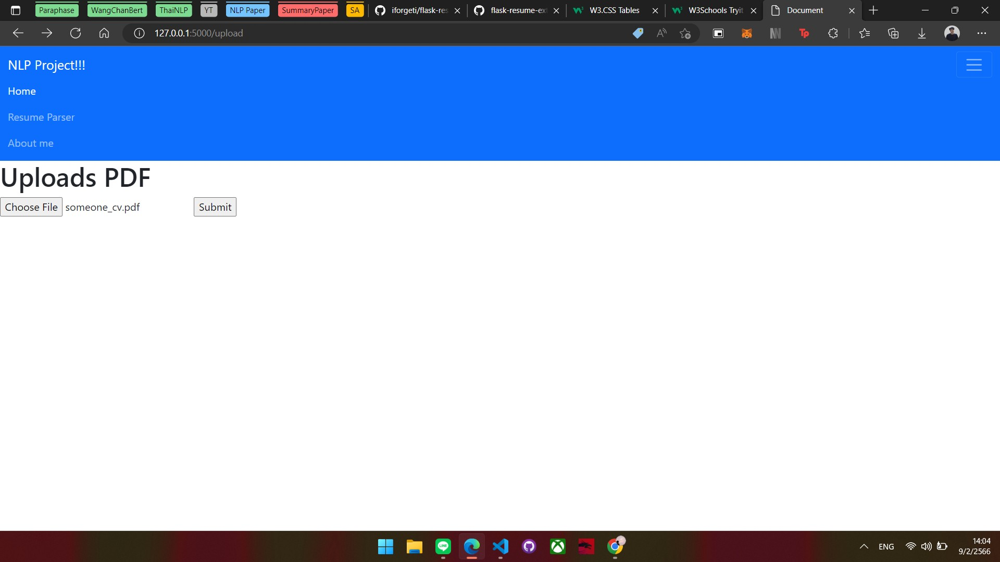
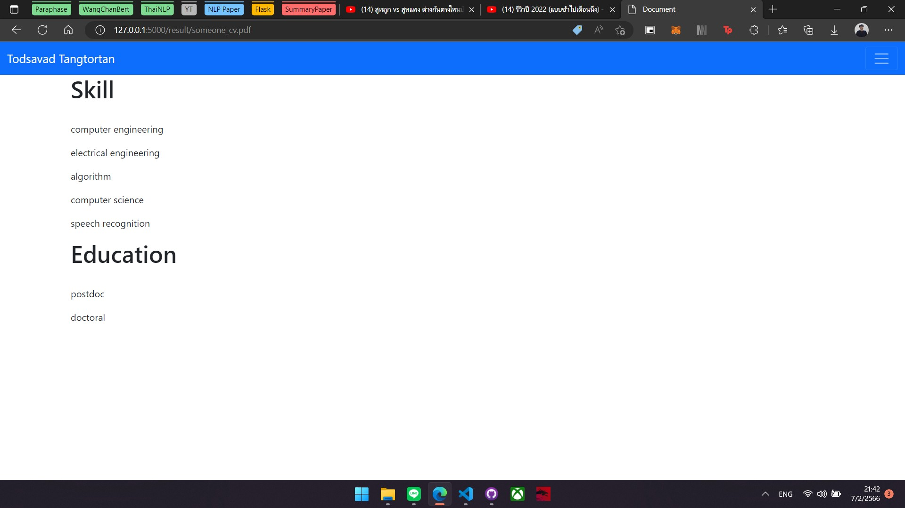

# Resume Parser

## Upload Page


## Result


```
.
│   dataConversion.py
│   main.py
│
├───figures
│       01_Upload.jpg
│       02_Result.jpg
│
├───static
│   │   chihuahua-1.jpg
│   │   chihuahua-2.jpg
│   │   educations.jsonl
│   │   skills_educations.jsonl
│   │
│   └───files
├───templates
│       about.html
│       admin.html
│       index.html
│       index2.html
│       lab05.html
│       layout.html
│       result.html
│       thankyou.html
│       upload.html
│
└───__pycache__
        dataConversion.cpython-310.pyc
        data_stealer.cpython-310.pyc
        pdf.cpython-310.pyc
        pdf_.cpython-310.pyc
```