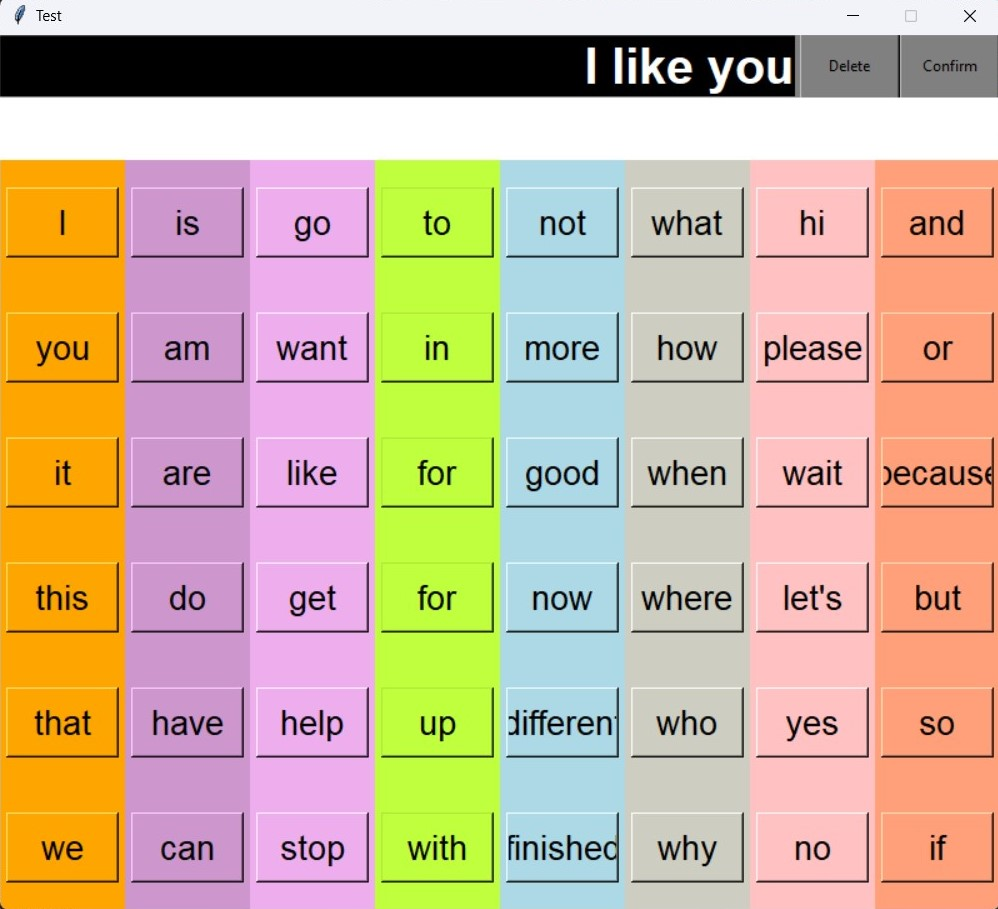

# Autistic Application using Dependency Parsing 
This project aims to create Graphical User Interface (GUI) which is support special kids with autism and other non-verbal communicators and particularly related to Data structures and algorithms by using Dependency Parsing which is a part of Speech and Language Processing. Then comparing efficiency of each algorithm.

## Dependencies :
- Tkinter Library
    - https://docs.python.org/3/library/tkinter.html
- Spacy Library
    - https://spacy.io/usage/spacy-101
    - en_web_core_sm model

## Components

- main.py
    - Graphical User Interface using Tkinter *Complete*
- algorithm.ipynb
    1. Transition-Based Dependency Parsing
        - Stack : Enqueue and Dequeue *Complete*
        - Stack and Buffer
            - Projective using Arc-Standard *Complete*
            - Nonjective using Arc-Eager *FutureWork*
        - Dependency Tree
            - Breath-first Search (BST) *Complete*
            - Depth-first Search (DFS) *Complete*
            - Beam Search *FutureWork*
    2. Graph-Based Dependency Parsing
        - Chu-Liu-Edmonds : Maximum Spanning Tree *FutureWork*

## Limitation
- Compound Sentence has to change ARC-Standard to ARC-Eager algorithm instead 

## Future Work
- Implementation Non-projective
- Implementation Oracle using Machine Learning Model
- Implementatio arc-eager algorithm
- Agreement Structure : For example: He drink(s)
- Add Speech interactive

## Reference
- Chapter 15 Dependency Parsing, Speech and Language Processing. Daniel Jurafsky & James H. Martin. Copyright c 2019. All rights reserved. Draft of October 2, 2019.
- Covington, M. A. (2001). A fundamental algorithm for dependency parsing. In Proceedings of the 39th annual ACM southeast conference (Vol. 1).
- Nivre, J. (2003, April). An efficient algorithm for projective dependency parsing. In Proceedings of the eighth international conference on parsing technologies (pp. 149-160).